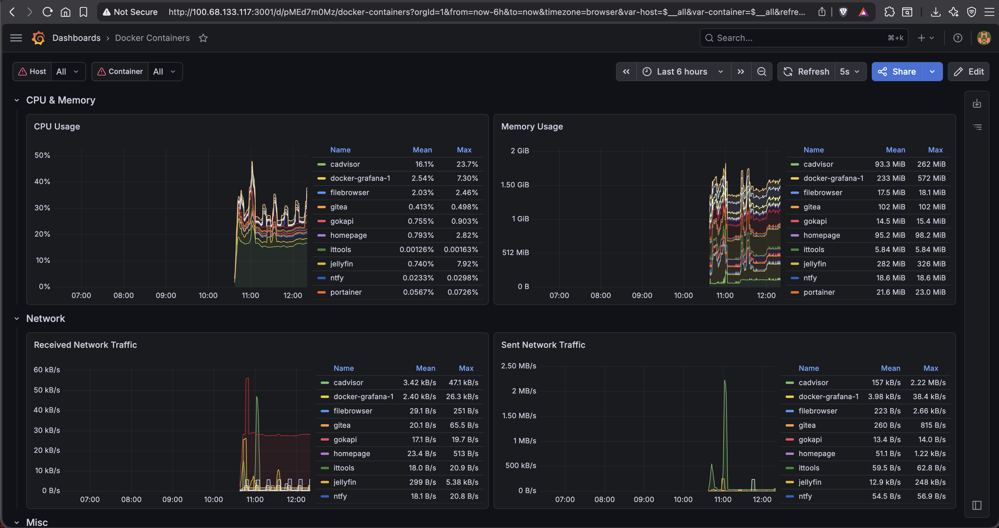
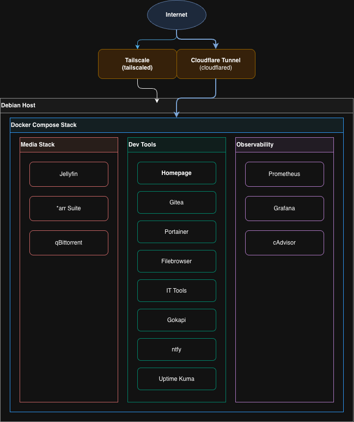

# homelab

A self hosted server running on a headless debian machine. All public services on it are exposed via a Cloudflare Tunnel, so there are no open ports on the system. Admin and system config related services are only accessible over tailscale and never exposed to public internet.




---

## Architecture

<div style="display: flex; justify-content: center; align-items: center; margin-top: 20px;">

<div>


<p style="font-weight: bold; margin-left:28px;">Remote access to the server is handled by two layers:</p>

- **Cloudflare Tunnel** — public-facing services exposed via subdomains on `0xpkj.tech`, zero open firewall ports.
- **Tailscale** — private admin access (Portainer, Grafana, Prometheus, Gitea) over WireGuard mesh, never public.
</div>
</div>

---

## Stack

- All services except ittools, homepage have their own auth, so they are protected by a username and password. The homepage serves as a dashboard and quick access point to the other services.

| Service | Purpose | Public URL |
|---------|---------|------------|
| Jellyfin | Media server | watch.0xpkj.tech |
| Radarr | Movie management | movies.0xpkj.tech |
| Sonarr | TV show management | series.0xpkj.tech |
| Prowlarr | Indexer manager | — |
| qBittorrent | Download client | — |
| Gitea | Self-hosted Git | git.0xpkj.tech |
| Portainer | Docker management UI | — |
| Filebrowser | Web-based file manager | — |
| IT Tools | Developer utilities | tools.0xpkj.tech |
| Gokapi | Temporary file sharing | drop.0xpkj.tech |
| ntfy | Push notifications | ntfy.0xpkj.tech |
| Uptime Kuma | Uptime monitoring | uptime.0xpkj.tech |
| Homepage | Dashboard | trexible.0xpkj.tech |
| Prometheus | Metrics collection | — |
| Grafana | Metrics visualization | — |
| cAdvisor | Container metrics exporter | — |

---

## Observability

All containers are scraped by Prometheus via cAdvisor, which reads directly from the Docker socket. Grafana visualizes CPU, memory, and network per container in real time.

```
Docker containers → cAdvisor (/metrics) → Prometheus → Grafana
```

Memory usage across all containers stays under 2.5 GiB at idle. Jellyfin peaks on active transcoding sessions. The device I am hosting this on is capable of handling multiple jellyfin movie streams at once with a small caveat, that those devices are mobile devices or laptops. Streaming to a TV screen causes significant buffering.

---

## Networking

**Cloudflare Tunnel** runs as a systemd service (`cloudflared`) on the host. It establishes an outbound-only persistent connection to Cloudflare's edge. Incoming traffic on `*.0xpkj.tech` is routed through this tunnel to the appropriate container no firewall ports are opened, the server's public IP is never exposed.

**Tailscale** creates a WireGuard mesh between my devices. Admin services bind to `0.0.0.0` but are only reachable from within the Tailscale network. The server's Tailscale hostname is `trexible`.

---

## Hardware

- **Host**: Debian 13 (Trixie), running headless 24/7 (almost)
- **Access**: Fully managed over a local SSH session or one over Tailscale.
- **CPU**: Intel Core i5-8250U (4 cores, 8 threads, 15W TDP)
- **RAM**: 8 GB DDR4
- **Storage**: 500 GB SATA SSD (WD Blue SA510)

Since the host laptop has no battery, powercuts cause an immediate shutdown. As of now nothing has been done to mitigate this. Restarting is a problem as i face the BIOS warning due to missing battery which requires a manual keypress to bypass. I have set the system to automatically start on power restore, but the BIOS warning is still an issue. Will consider a UPS or a battery replacement in the future. Maybe.

---

## Setup

**Prerequisites**: Docker, Docker Compose, Tailscale, a Cloudflare account with a domain and patience. I faced a lot of difficulties as it was my very first time setting up a homelab and using these tools, so be prepared to do a lot of googling and reading documentation.

```bash
git clone https://github.com/jhapriyansh/homelab
cd homelab

docker compose up -d
```

Configure your Cloudflare tunnel and point each subdomain to `localhost:PORT` matching the service you want exposed. Make sure the services that can change the hardware state of the server (like Portainer) are not exposed publicly, and only accessible over Tailscale.

Also be sure to set the permissions carefully as a wrong chown can lock you out of the server and maybe require manual intervention if tailscale is stopped by the system due to permission issues.

## Notable Problems Solved

**Inter-container networking broken after adding Incus alongside Docker**
Containers on the same bridge couldn't reach each other. Traced it with `tcpdump` to `bridge-nf-call-iptables=1` sending bridge traffic through iptables, which had no FORWARD rule for the subnet. Fixed with a targeted iptables rule instead of disabling the sysctl globally, preserving Docker's own isolation. This was a nightmare to debug, I'm pretty sure easier solutions might exist but I do not know what they are.

**Prometheus permission denied on startup**
Prometheus runs as uid 65534 (nobody) inside the container. The mounted data directory was owned by root. Fixed by setting user: "65534:65534" in compose and chowning the data directory.

---

## Resources

- [Cloudflare Tunnel docs](https://developers.cloudflare.com/cloudflare-one/connections/connect-networks/)
- [Tailscale docs](https://tailscale.com/kb)
- [LinuxServer.io images](https://docs.linuxserver.io) : used for Jellyfin, *arr stack
- [Grafana dashboard 14282](https://grafana.com/grafana/dashboards/14282) : cAdvisor container metrics
